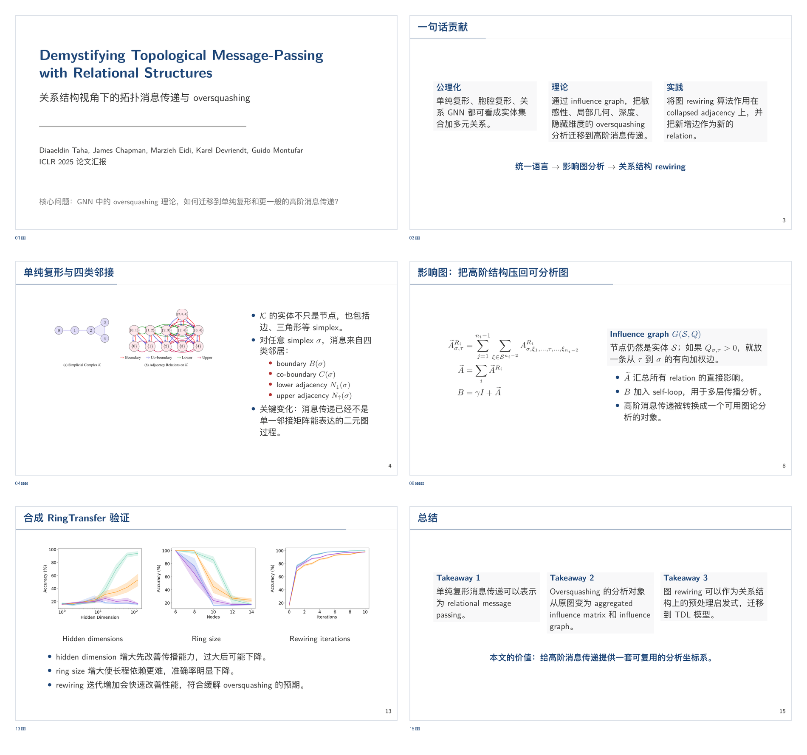

# paper-to-latex-ppt

> 研究生应付组会专用：把一篇论文 PDF 尽快变成一份可以直接上阵的中文 PPT，自动生成逐页讲稿，并写进 PowerPoint 备注区。

明天组会，今晚才开始看 paper。白天偷跑实习，晚上还要假装科研进展稳定。导师临时丢来一篇论文，让你“下次组会讲一下”。  
这个 skill 的目标很直接：先把一份 **能讲、像样、有备注** 的组会 PPT 初稿救出来。

它不是论文摘要工具，而是一个面向“组会交付”的生成流程：

- `final_with_notes.pptx`：最终 PPT，备注区里有逐页讲稿，优先拿这个去讲。
- `speaker_notes.md`：独立讲稿，开讲前快速顺一遍。
- `slides.tex`：LaTeX 源文件，有时间还能继续精修。
- `slides.pdf`：由 LaTeX 编译出的视觉基准版本。

| 能力 | 作用 |
| --- | --- |
| 论文结构化阅读 | 抽取背景、动机、方法、公式、实验和局限性 |
| LaTeX Beamer 生成 | 保留公式质量，统一中文组会风格 |
| PDF 渲染检查 | 编译后逐页检查，避免溢出、太密、图糊 |
| PPTX 导出 | 每页高清插入 PPT，方便最终汇报 |
| 备注区讲稿 | 每页生成可照着讲的 speaker notes |

## 效果预览

一套端到端生成、零人工中间介入的组会 PPT 精选页：



## 它到底帮你省了什么

普通 AI 工具很容易做到“总结论文”，但组会真正需要的是一份能打开就讲的 PPT：

- 有背景、动机、输入输出、算法流程、实验和总结。
- 有 LaTeX 原生公式，看起来不像截图糊上去的。
- 有论文原图，显得你真动手读了。
- 有 PowerPoint 备注区讲稿，临场不至于卡壳。
- 有编译后的 PDF 页面检查，避免打开 PPT 才发现溢出、太密、图糊。

`paper-to-latex-ppt` 把流程固定成一条可检查的 pipeline：

```text
Paper PDF
  -> 结构化阅读：正文 / 公式 / 图片 / caption
  -> 15 页左右组会大纲
  -> LaTeX Beamer
  -> PDF 编译
  -> 页面渲染与自我检查
  -> LaTeX 回改
  -> PPTX 导出
  -> 逐页讲稿
  -> PPT 备注区注入
```

关键点：**不会只生成 `.tex` 就结束**。它要求实际编译 PDF、渲染页面截图、检查排版问题，再修正。否则“看起来生成了，打开全是溢出”这种事很容易发生在组会前十分钟。

## 安装方式

最朴素的方式：把这个仓库链接丢给 Codex/Agent，让它帮你安装。

复制这句话给 Agent：

```text
给我安装下这个 git 链接对应的 skill：
https://github.com/moyoo0/paper-to-latex-ppt.git
```

它实际会做的事情本质上就是：

```bash
git clone https://github.com/moyoo0/paper-to-latex-ppt.git
mkdir -p "${CODEX_HOME:-$HOME/.codex}/skills"
ln -sfn /path/to/cloned/paper-to-latex-ppt \
  "${CODEX_HOME:-$HOME/.codex}/skills/paper-to-latex-ppt"
```

如果你已经 clone 到本地，也可以直接让 Agent 说：

```text
把当前仓库安装成 Codex skill，skill 名称是 paper-to-latex-ppt。
```

## 运行依赖

完整生成 PDF/PPT 需要两类依赖：Python 包和本地 LaTeX。

### Python 依赖

推荐直接使用仓库里的 `requirements.txt`：

```bash
python3 -m pip install -r requirements.txt
```

如果不想污染系统 Python，可以用虚拟环境：

```bash
python3 -m venv .venv
.venv/bin/python -m pip install -r requirements.txt
```

### LaTeX 依赖

还需要本地能找到：

```text
latexmk
xelatex
```

macOS 上可以用 TinyTeX：

```bash
curl -fsSL https://yihui.org/tinytex/install-bin-unix.sh | sh
```

并确保 TinyTeX 的 bin 目录在 `PATH` 中。

常见 macOS 路径是：

```bash
export PATH="$PATH:$HOME/Library/TinyTeX/bin/universal-darwin"
```

### 环境检查

安装后可以运行：

```bash
python3 scripts/check_environment.py
```

如果用了虚拟环境：

```bash
.venv/bin/python scripts/check_environment.py
```

## 怎么用

把论文放在当前目录，例如：

```text
paper.pdf
```

然后在 Codex 里直接说中文：

```text
使用 $paper-to-latex-ppt，把 paper.pdf 做成一份中文组会 PPT。
目标是明天可以直接讲，15 页左右，必须包含背景、动机、输入输出、算法流程、核心公式、实验设置、实验结果和总结。
请生成 PPTX，并把逐页讲稿写入 PPT 备注区。
```

如果你有自己的 TeX 模板：

```text
使用 $paper-to-latex-ppt，把 paper.pdf 做成中文组会 PPT。
优先使用当前目录下的 TeX 模板和宏包风格。
不要只生成 LaTeX，必须编译 PDF、检查页面、修正排版，然后导出带备注区讲稿的 PPTX。
```

## 推荐提示词

### 临阵磨枪版

```text
使用 $paper-to-latex-ppt 阅读 paper.pdf，帮我做一份明天组会能直接讲的中文 PPT。
页数控制在 15 页左右，重点是能应付组会：背景、动机、输入输出、算法流程、关键公式、实验和总结都要有。
请自动截取论文核心图片，公式尽量用 LaTeX 原生公式。
生成后必须编译成 PDF，渲染检查每页，如果有溢出、太密、图片不清楚或公式不可读，就回改 LaTeX。
最后输出 final_with_notes.pptx，并把每页讲稿写入 PowerPoint 备注区。
```

### 稍微认真版

```text
使用 $paper-to-latex-ppt 把 paper.pdf 转成中文组会汇报 PPT。
请先通读论文，提炼研究问题、方法主线、核心公式、关键实验和局限性。
默认 15 页左右，要求每页只讲一个主点，图和公式都要能在讲稿里解释清楚。
最终交付 slides.tex、slides.pdf、final_with_notes.pptx 和 speaker_notes.md。
```

## 默认汇报结构

默认生成 12-18 页，最佳约 15 页，目标是“组会上能顺着讲完”：

1. 标题页
2. 背景与任务
3. 动机与现有方法缺口
4. 问题定义：输入、输出、符号
5. 方法总览图
6. 模块/算法流程 1
7. 模块/算法流程 2
8. 核心公式或优化目标
9. 训练/推理流程
10. 实验设置
11. 主结果
12. 消融实验
13. 可视化、案例或误差分析
14. 局限性与讨论
15. 总结与 takeaways

具体页数会根据论文内容调整，但必须覆盖背景、动机、输入输出、算法流程、核心公式和实验。

## 输出文件

默认输出到按日期和论文名命名的独立目录，避免多次生成互相覆盖：

```text
output/
└── YYYYMMDD_paper-name/
    ├── paper_assets.json
    ├── slide_plan.json
    ├── slides.tex
    ├── slides.pdf
    ├── final.pptx
    ├── final_with_notes.pptx
    ├── speaker_notes.md
    ├── speaker_notes.json
    ├── figures/
    └── page_images/
```

最常用的是：

- `final_with_notes.pptx`：优先拿这个去讲，备注区已有讲稿。
- `speaker_notes.md`：开讲前快速过一遍。
- `slides.tex`：有时间就继续改。
- `slides.pdf`：检查最终视觉效果。

## 适合什么场景

- 明天组会，今晚才开始看论文。
- 偷跑实习，没空科研，但组会不能鸽。
- 项目太忙，paper 只来得及临阵磨枪。
- 导师临时让你“下次讲一下这篇”。
- 需要一份看起来完整、能顺着讲的中文 PPT 初稿。
- 希望每页都有备注区讲稿，至少上台不至于卡壳。

它生成的是救急初稿，不是免读论文许可证。真正上场前仍建议自己通读 `speaker_notes.md`，至少确认公式解释、图表结论和实验细节没有偏离论文。
