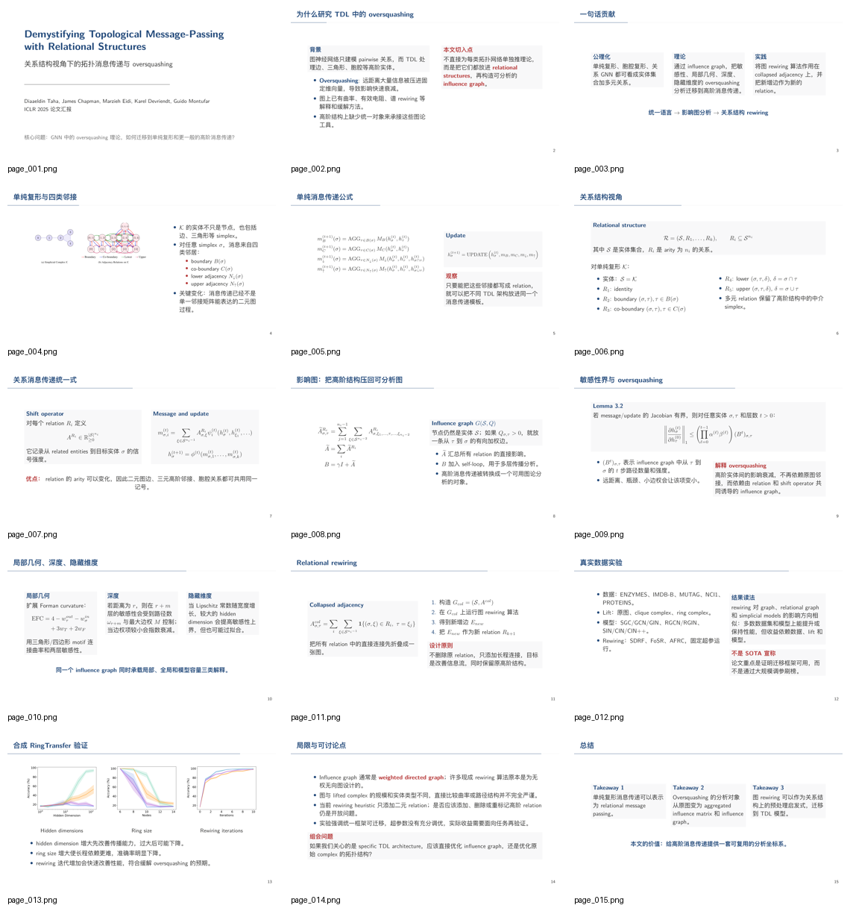

# paper-to-latex-ppt

研究生应付组会专用：把一篇论文 PDF 尽快变成一份可以直接上阵的中文 PPT，顺带生成逐页讲稿，并写进 PowerPoint 备注区，方便聪明的你演讲者视图。

适用场景很朴素：明天组会，今晚才开始看 paper；白天偷跑实习，晚上还要装作科研进展稳定；导师临时丢来一篇论文，让你下次组会讲一下。这个 skill 的目标就是先把“能讲、像样、有备注”的 PPT 初稿救出来。

它不是单纯总结论文，而是产出一套组会交付物：

- `final_with_notes.pptx`：可以直接打开讲的 PPT，备注区里有逐页讲稿。
- `speaker_notes.md`：单独的逐页讲稿，方便开讲前快速顺一遍。
- `slides.tex`：LaTeX 源文件，来得及的话还能继续手工微调。
- `slides.pdf`：由 LaTeX 编译出的视觉基准版本。

## 效果预览

一套端到端生成的，零人工中间介入的PPT：



## 为什么需要它

- 偷跑实习，临阵磨枪做PPT，调格式，插公式插的心烦意乱
- 优美的LaTeX 原生公式，导师都夸你科研认真，却不知道你是五分钟做出来的。
- 有论文原图，这才显得你真动手做了。
- 临阵磨枪时最怕没有讲稿，每页备注区最好能直接照着讲。
- ai工具生成排版丑？ skill驱动agent自动修！。

这个 skill 把这些事串成一个固定流程：

```text
读取论文
  -> 提取正文、公式、图片和 caption
  -> 规划 15 页左右组会结构
  -> 生成 LaTeX Beamer
  -> 编译 PDF
  -> 渲染每一页并检查
  -> 回改 LaTeX 自我纠错
  -> 转成 PPTX
  -> 生成逐页讲稿
  -> 写入 PPT 备注区
```

关键点：它不会只生成 `.tex` 就结束。必须实际编译 PDF、渲染页面截图、检查排版问题，再修正。否则“看起来生成了，打开全是溢出”这种事会在组会前十分钟发生。

## 默认汇报结构

默认生成 12-18 页，最佳约 15 页，目标是“组会上能顺着讲完”：

1. 标题页
2. 背景与任务
3. 动机与现有方法缺口
4. 问题定义：输入、输出、符号
5. 方法总览图
6. 模块/算法流程 1
7. 模块/算法流程 2
8. 核心公式或优化目标
9. 训练/推理流程
10. 实验设置
11. 主结果
12. 消融实验
13. 可视化、案例或误差分析
14. 局限性与讨论
15. 总结与 takeaways

具体页数会根据论文内容调整，但必须覆盖背景、动机、输入输出、算法流程、核心公式和实验。

## 输出文件

默认输出到 `output/`：

```text
output/
├── paper_assets.json
├── slide_plan.json
├── slides.tex
├── slides.pdf
├── final.pptx
├── final_with_notes.pptx
├── speaker_notes.md
├── speaker_notes.json
├── figures/
└── page_images/
```

最常用的是：

- `final_with_notes.pptx`：优先拿这个去讲，备注区已有讲稿。
- `speaker_notes.md`：开讲前快速过一遍。
- `slides.tex`：有时间就继续改。
- `slides.pdf`：检查最终视觉效果。

## 安装

将本仓库放到 Codex skills 目录：

```bash
mkdir -p "${CODEX_HOME:-$HOME/.codex}/skills"
ln -sfn /Users/wuzhengyang/Documents/workspace/paper-to-latex-ppt \
  "${CODEX_HOME:-$HOME/.codex}/skills/paper-to-latex-ppt"
```

如果是在另一台机器上，先 clone 仓库：

```bash
git clone <repo-url>
mkdir -p "${CODEX_HOME:-$HOME/.codex}/skills"
ln -sfn /path/to/cloned/paper-to-latex-ppt \
  "${CODEX_HOME:-$HOME/.codex}/skills/paper-to-latex-ppt"
```

## 运行依赖

完整生成 PDF/PPT 需要 Python 包：

```bash
python3 -m pip install pymupdf python-pptx pyyaml
```

以及 LaTeX 工具：

```text
latexmk
xelatex
```

macOS 上可以用 TinyTeX：

```bash
curl -fsSL https://yihui.org/tinytex/install-bin-unix.sh | sh
```

并确保 TinyTeX 的 bin 目录在 `PATH` 中。

## 使用

新开 Codex 会话，在包含 `paper.pdf` 的目录里说：

```text
Use $paper-to-latex-ppt to turn paper.pdf into a Chinese group-meeting PPT I can present tomorrow. Aim for about 15 slides, include background, motivation, input/output, algorithm flow, key formulas, experiments, and speaker notes in the PPT.
```

如果你有自己的 TeX 模板，把模板文件放在当前目录，然后说明：

```text
Use $paper-to-latex-ppt to convert paper.pdf into a Chinese PPT. Use the local TeX template files.
```

skill 会优先使用当前目录下的 `.tex`、`.sty`、主题、字体和图片资源；没有本地模板时，才使用内置的 Metropolis 风格中文 Beamer 模板。
