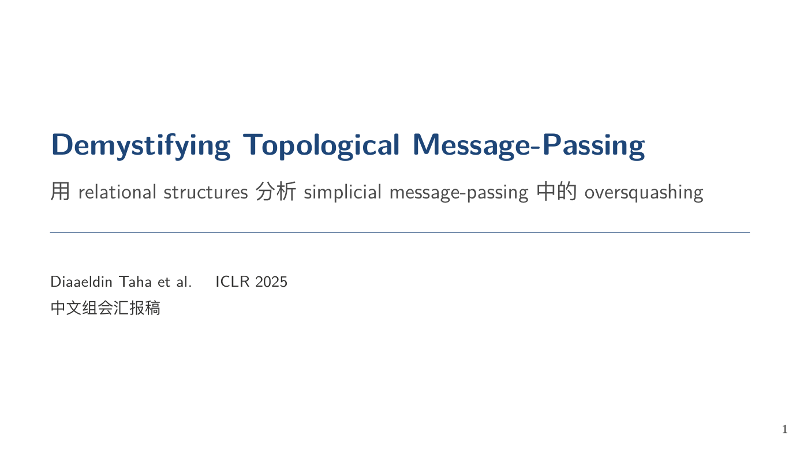
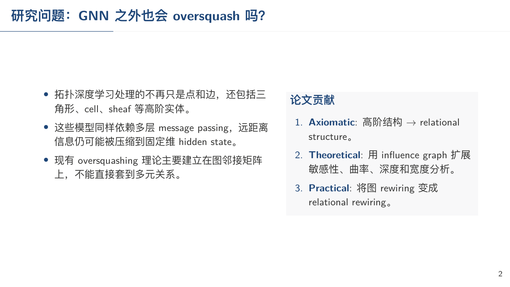
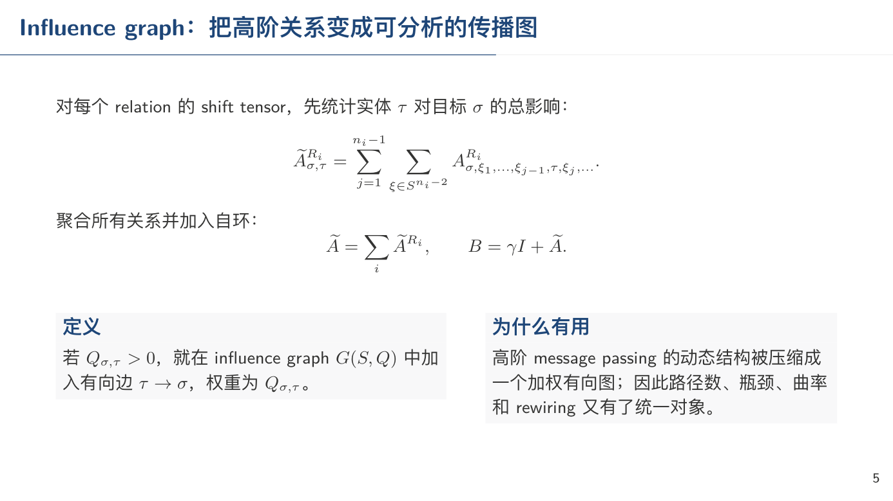
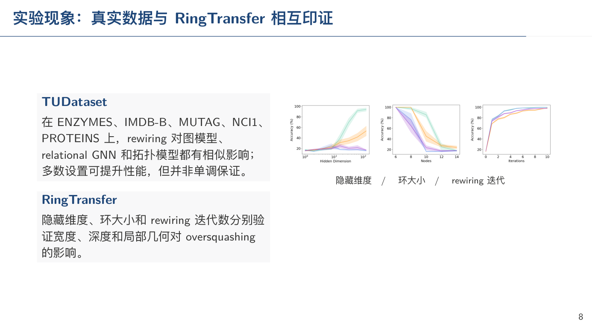

# paper-to-latex-ppt

最快时间把一篇论文 PDF 变成一份可以直接上阵的中文组会 PPT：有 LaTeX 排版、有核心图和公式、有逐页讲稿，并把讲稿写入 PowerPoint 备注区。

这个 skill 的核心场景很明确：研究生要应付论文组会，需要尽快产出一份“能讲”的 PPT，而不是从零读论文、裁图、抄公式、调模板、写讲稿。尤其适合人在实习、项目很忙、组会又不能空手去的情况。

它的目标不是生成一份“论文摘要”，而是生成一套组会交付物：`final_with_notes.pptx` 可以直接打开讲，`speaker_notes.md` 可以提前顺一遍口径，`slides.tex` 也能继续手工微调。

## 效果示例

标题页：



背景与动机：



方法与公式：



实验结果：



## 它解决什么问题

论文组会最痛的不是“完全看不懂”，而是时间不够。你可能晚上才想起来明天要讲，或者实习期间白天没空，结果还要交一份看起来像认真准备过的 PPT。麻烦通常在几个地方：

- 论文很长，但组会只需要 15 页左右，必须快速取舍。
- PPT 不能只是摘要，得讲清楚背景、动机、输入输出、算法流程和实验。
- 公式要能讲，最好是 LaTeX 原生公式，而不是模糊截图。
- 核心图片要从 PDF 里截出来，还要清晰、比例正确、放得下。
- 每页都最好有备注区讲稿，否则临场很容易卡住。
- LaTeX 生成后经常会溢出、太密、图片不可读，需要编译后检查。

这个 skill 把这些步骤串成一个固定流程：

```text
读取论文
  -> 提取正文、公式、图片和 caption
  -> 规划 15 页左右组会结构
  -> 生成 LaTeX Beamer
  -> 编译 PDF
  -> 渲染每一页并检查
  -> 回改 LaTeX 自我纠错
  -> 转成 PPTX
  -> 生成逐页讲稿
  -> 写入 PPT 备注区
```

关键点是它不会只生成 `.tex` 就结束，而是要求实际编译 PDF、渲染页面截图、检查排版问题，然后再修正。

## 默认汇报结构

默认生成 12-18 页，最佳约 15 页，目标是“组会上能顺着讲完”：

1. 标题页
2. 背景与任务
3. 动机与现有方法缺口
4. 问题定义：输入、输出、符号
5. 方法总览图
6. 模块/算法流程 1
7. 模块/算法流程 2
8. 核心公式或优化目标
9. 训练/推理流程
10. 实验设置
11. 主结果
12. 消融实验
13. 可视化、案例或误差分析
14. 局限性与讨论
15. 总结与 takeaways

具体页数会根据论文内容调整，但必须覆盖背景、动机、输入输出、算法流程、核心公式和实验。

## 输出文件

默认输出到 `output/`：

```text
output/
├── paper_assets.json
├── slide_plan.json
├── slides.tex
├── slides.pdf
├── final.pptx
├── final_with_notes.pptx
├── speaker_notes.md
├── speaker_notes.json
├── figures/
└── page_images/
```

最常用的是：

- `slides.tex`：可继续手工修改的 LaTeX 源文件。
- `slides.pdf`：LaTeX 编译后的权威视觉版本。
- `final.pptx`：每页由 PDF 高清图插入的 PPT。
- `final_with_notes.pptx`：带 PowerPoint 备注区讲稿的最终版本，优先拿这个去讲。
- `speaker_notes.md`：逐页讲稿，方便单独阅读和修改。

## 安装

将本仓库放到 Codex skills 目录：

```bash
mkdir -p "${CODEX_HOME:-$HOME/.codex}/skills"
ln -sfn /Users/wuzhengyang/Documents/workspace/paper-to-latex-ppt \
  "${CODEX_HOME:-$HOME/.codex}/skills/paper-to-latex-ppt"
```

如果是在另一台机器上，先 clone 仓库：

```bash
git clone <repo-url>
mkdir -p "${CODEX_HOME:-$HOME/.codex}/skills"
ln -sfn /path/to/cloned/paper-to-latex-ppt \
  "${CODEX_HOME:-$HOME/.codex}/skills/paper-to-latex-ppt"
```

## 运行依赖

完整生成 PDF/PPT 需要 Python 包：

```bash
python3 -m pip install pymupdf python-pptx pyyaml
```

以及 LaTeX 工具：

```text
latexmk
xelatex
```

macOS 上可以用 TinyTeX：

```bash
curl -fsSL https://yihui.org/tinytex/install-bin-unix.sh | sh
```

并确保 TinyTeX 的 bin 目录在 `PATH` 中。

## 使用

新开 Codex 会话，在包含 `paper.pdf` 的目录里说：

```text
Use $paper-to-latex-ppt to convert paper.pdf into a Chinese group-meeting PPT with detailed speaker notes.
```

更贴近应付组会的 prompt 可以直接写：

```text
Use $paper-to-latex-ppt to turn paper.pdf into a Chinese group-meeting PPT I can present tomorrow. Aim for about 15 slides, include background, motivation, input/output, algorithm flow, key formulas, experiments, and speaker notes in the PPT.
```

如果你有自己的 TeX 模板，把模板文件放在当前目录，然后说明：

```text
Use $paper-to-latex-ppt to convert paper.pdf into a Chinese PPT. Use the local TeX template files.
```

skill 会优先使用当前目录下的 `.tex`、`.sty`、主题、字体和图片资源；没有本地模板时，才使用内置的 Metropolis 风格中文 Beamer 模板。

## 适合什么场景

- 明天组会，今晚才开始准备论文汇报。
- 偷跑实习或项目太忙，没时间从零做组会 PPT。
- 老师/mentor 临时丢来一篇 paper，要尽快讲出背景、方法和实验。
- 需要一份“看起来完整、能顺着讲”的中文 PPT 初稿。
- 需要中文讲稿，但论文和公式主要是英文。
- 希望 PPT 每页都有可直接照着讲的 speaker notes。
- 想保留 LaTeX 公式质量，同时最后交付 PPTX。

它生成的是一个“能先救急、还能继续改”的组会初稿，不替代你对论文的判断。真正上场前仍建议自己通读 `speaker_notes.md`，至少确认公式解释、图表结论和实验细节没有偏离论文。
